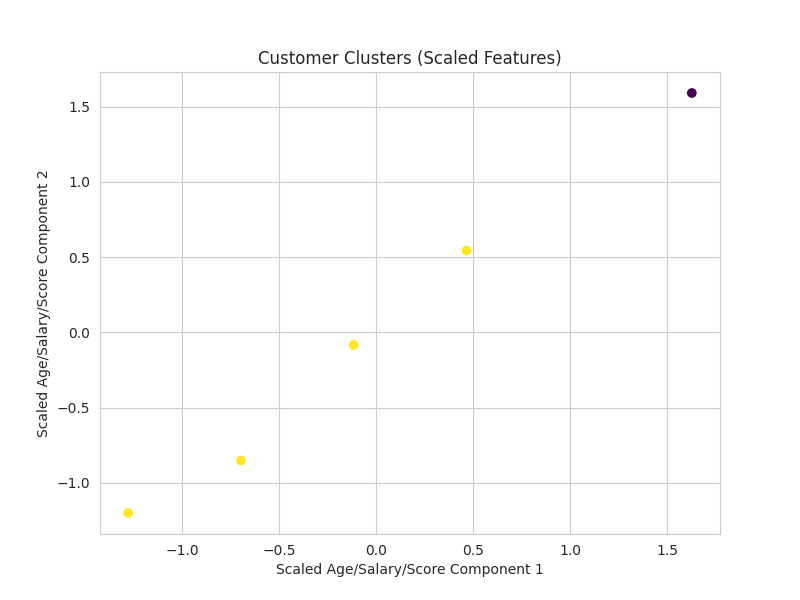
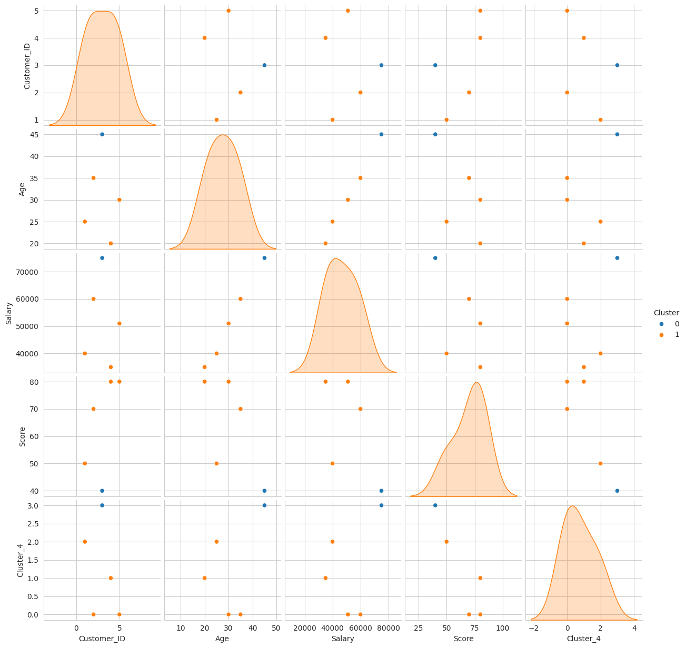

# 🚀 Customer Segmentation Analysis using K-Means Clustering


---

## 📌 Project Overview
Customer segmentation helps businesses identify distinct groups of customers to deliver personalized services, marketing campaigns, and promotions.  

In this project, we use **K-Means Clustering** to segment customers based on **Age, Annual Income, and Spending Score**.

---

## 🎯 Objective
- Identify different types of customers for **targeted marketing**  
- Discover **spending patterns** and customer behavior  
- Help businesses make **data-driven marketing decisions**

---

## 🗂 Dataset
- Source: [Upload your dataset or link here]  
- Features:
  - `CustomerID`: Unique customer identifier  
  - `Gender`: Male/Female  
  - `Age`: Customer age  
  - `Annual Income (k$)`: Customer income  
  - `Spending Score (1-100)`: Spending behavior score  

---

## 🛠 Tech Stack
- **Python**  
- **Pandas & NumPy** (Data manipulation & analysis)  
- **Scikit-Learn** (K-Means Clustering)  
- **Matplotlib & Seaborn** (Data visualization)  

---

## 🧩 Methodology
1. **Data Cleaning & Preprocessing**: Handle missing values, remove duplicates, and check for outliers.  
2. **Exploratory Data Analysis (EDA)**: Analyze the distribution of Age, Income, and Spending Score.  
3. **Feature Selection**: Use `Age`, `Annual Income`, and `Spending Score` for clustering.  
4. **K-Means Clustering**:
   - Determine optimal clusters using the **Elbow Method**  
   - Apply K-Means algorithm  
5. **Visualization**:  
   - Scatter plots to visualize clusters  
   - Pair plots to explore feature relationships  

---

## 📊 Key Insights
- **Young high-spending customers** → Ideal for premium marketing campaigns  
- **Older low-spending customers** → May require loyalty programs or special offers  
- Segmentation helps businesses **personalize marketing** and improve ROI  

---

## 📈 Visualizations
  
  
> *Replace the image links with your actual plot images uploaded to the repo.*

---

## 💻 How to Run
1. Clone the repository:  
```bash
git clone https://github.com/Harshu2326/Customer-Segmentation-Project.git
